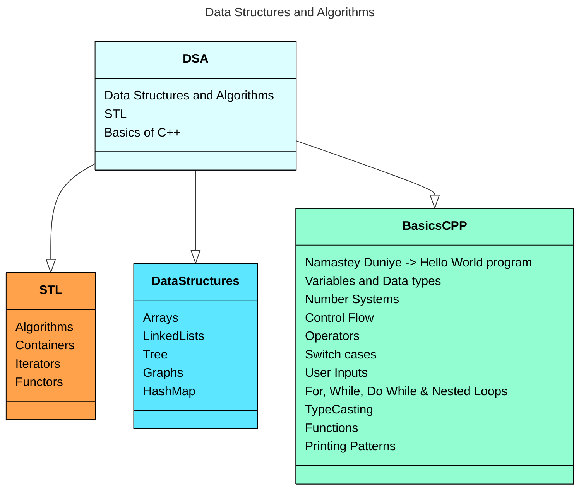

# Hey!
##  Enhancing my expertise in Data Structures and Algorithms to drive efficient problem-solving and innovative software development
----------------------------------------------------------------------------------------------------------------------------------------
I've been actively expanding my knowledge and skills in Data Structures and Algorithms, and I'm excited to continue exploring these fundamental concepts in computer science. Through dedicated learning and practice, I aim to deepen my understanding of these essential building blocks and apply them to develop efficient, scalable, and innovative solutions
----------------------------------------------------------------------------------------------------------------------------------------
## What you will find here,

You can render UML diagrams using [Mermaid](https://mermaidjs.github.io/). For example, this will produce a sequence diagram:

Md Footer: Generate Footer
